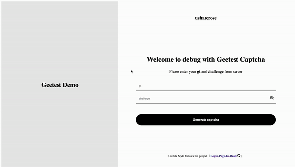

# Geetest Demo


**Geetest Demo** provides a web page on Geetest Captcha v3 integration

The web page style refers to the project [Login-Page-In-React](https://github.com/Kuzma02/Login-Page-In-React).

## Background

Here is the basic process on authentication with Geetest Captcha

1. [Request meta](https://docs.geetest.com/captcha/help/glossary/#API1) for generating captcha component, which come from the server side

    * [`gt`](https://docs.geetest.com/captcha/help/glossary/#id): captcha ID
    * [`challenge`](https://docs.geetest.com/captcha/help/glossary/#challenge): unique ID of a verification event

2. Initialize Geetest Captcha with official client SDK according to the above parameters

3. Interact with captcha to finish the verification. When succeed, the following parameters are provided by server:

    * [`challenge`](https://docs.geetest.com/captcha/help/glossary/#challenge): unique ID of a verification event provided when request
    * [`validate`](https://docs.geetest.com/captcha/help/glossary/#validate): mark whether the current captcha has been passed
    * [`seccode`](https://docs.geetest.com/captcha/help/glossary/#seccode): certification

4. Then client can request the [secondary verification](https://docs.geetest.com/captcha/overview/guide/#Step-4-Check-the-API2) if necessary

## Usage

This page simulate the process that generate captcha with meta (please prepare yourself) and illustrate the verification result.



You can view the page from,

* Online with [URL](https://usharerose.github.io/geetest-demo/)
* Local with [URL](localhost:30001) after the command `make run` succeed

## Development Environment

### Install dependencies
```bash
$ npm install
```

### Start locally
```bash
$ npm run dev
```
